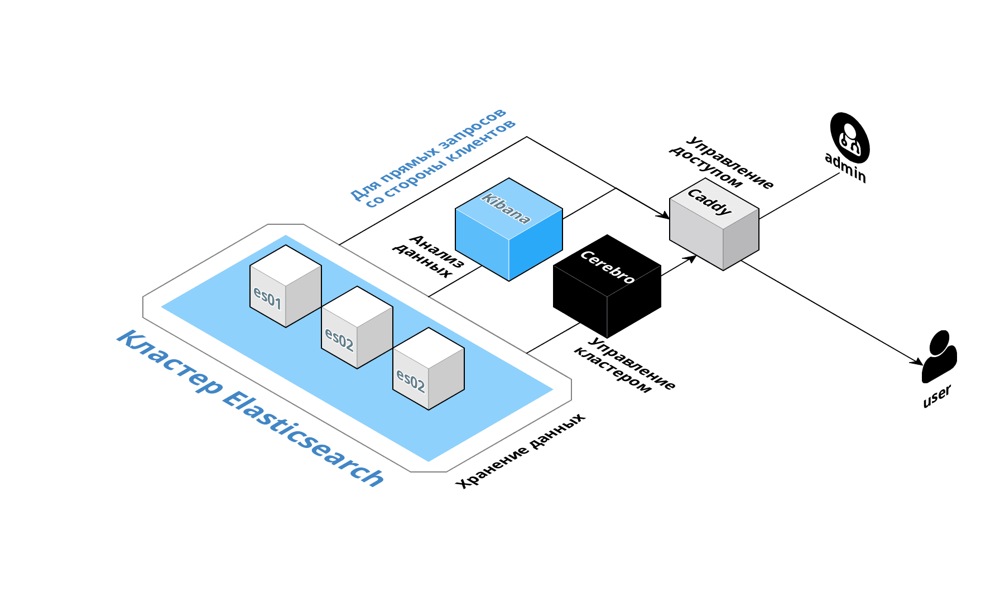
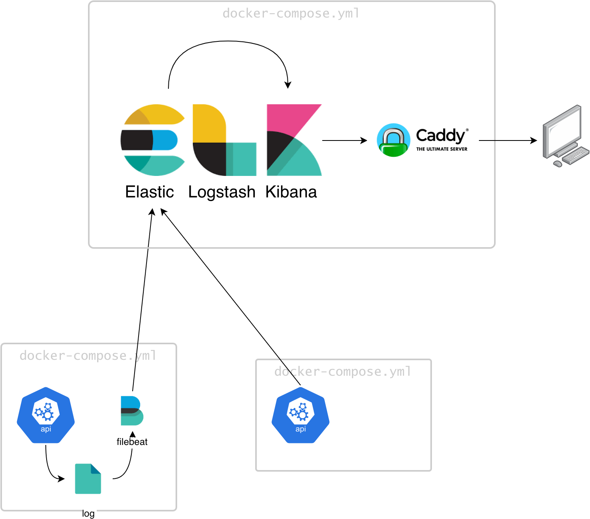
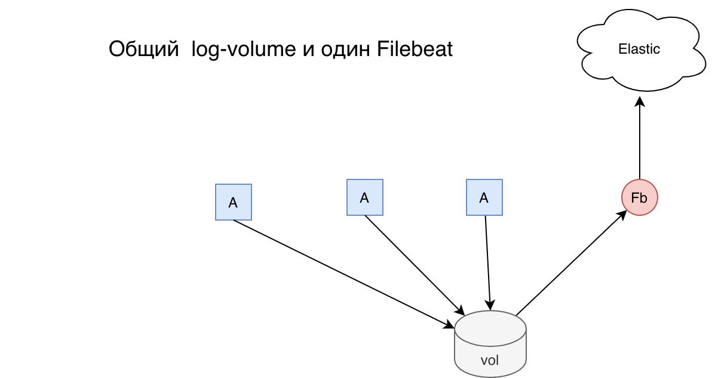

log-monitor
========
Сбор и анализ логов приложений RG.RU в Elasticsearch 

-------------------------------
## Ссылки

- Конечная точка Elasticsearch для GET запросов <https://log-monitor.rg.ru/elasticsearch/>

- POST запросы к Elasticsearch ограничены только SQL запросами <https://log-monitor.rg.ru/elasticsearch/_sql>

    ```bash
    curl -XPOST "https://log-monitor.rg.ru/elasticsearch/_sql?format=txt" \
    -H 'Content-Type: application/json' \
    -d'{  "query": "SELECT \"@timestamp\", log.file.path, message  FROM \"app-logs*\"  LIMIT 40"}'    
    ```


- Kibana  
<https://log-monitor.rg.ru>


- Управление докер-контейнерами 
<https://log-monitor.rg.ru/portainer/#/dashboard/>


- Пример запросов к Elasticsearch из Javascript <br>
  <https://log-monitor.rg.ru/www/><br> 
  <https://observablehq.com/d/9e4bdac324ef3667>


Файлы проекта размещены на: `dockerweb.rgwork.ru:/home/gitupdater/log-monitor-prod`


Мотивация
------------

**log-monitor** предназначен для сбора и анализа логов приложений. Это отличает данное приложение от <https://monitor.rg.ru> показывающего текущее состояние приложений.


Схема приложения
--------------


<!--  -->

<!--  -->

Контейнер log-monitor содержит кластер Elasticsearch, Kibana,  и Caddy.

- Кластер Elasticsearch - для хранения, поиска и анализа данных логов
- Kibana - для представления данных Elasticsearch в требуемом виде.
- Caddy - для обеспечения базовой аутентификации к Kibana и Elastic.


Приложения пишут логи в общий вольюм. Служба filebeat следит за файлами логов отправляюю новые строки в Эластик.




Настройка приложений для посылки логов в Эластик
-----------------------------------------------

1. Приложение должно сохранять логи в общий вольюм app-logs.
   В docker-compose.yml добавьте

        app-name:
        ...
            volumes: 
                - app-logs:/logs
            ...
    
    и в корень файла

        volumes:
            app-logs:
                external: true

2. Запись в логе должна занимать одну строку.
3. Сохраняйте логи в поддиректории названной по имени
    программы или включайте имя программы в имя файла лога. Так легче будет различать записи логов различных программ.

4. (необязательно) Вы можете сохранять логи в формате JSON. 
   Чтобы JSON распрарсился на поля перед посылкой в Эластик имя файла должно содержать подстроку "json".


Поиск логов приложений
-------------------------------
Три способа:
1. Из командной строки в JSON формате
    ```bash
    curl -XPOST "https://log-monitor.rg.ru/elasticsearch/_sql?format=json&pretty" \
    -H 'Content-Type: application/json' \
    -d'{  "query": "SELECT \"@timestamp\", log.file.path, message  FROM \"app-logs*\"  LIMIT 40"}'    
    ```
    В текстовом формате
    ```bash
    curl -XPOST "https://log-monitor.rg.ru/elasticsearch/_sql?format=txt" \
    -H 'Content-Type: application/json' \
    -d'{  "query": "SELECT \"@timestamp\", log.file.path, message  FROM \"app-logs*\"  LIMIT 40"}'    
    ```
   
2. Из Кибаны <https://log-monitor.rg.ru/app/kibana#/dev_tools/console>
3. Из плугина Chrome [Elasticsearch Head](https://chrome.google.com/webstore/detail/elasticsearch-head/ffmkiejjmecolpfloofpjologoblkegm?hl=en-GB&utm_source=chrome-ntp-launcher) подсоединитесь к 
   <https://log-monitor.rg.ru/elasticsearch/>. На вкладке Any Request сделайте GET запрос к конечной точке _search, 
   или POST  к конечной точке _sql. Другие запросы запрещены.


doker-compose.yml
-------------

- **log-script** приложение для генерации тестовых логов и
- **log-monitor-filebeat** для посылки их в индекс `app-logs` **Elasticsearch**.


Требования к системе
------

* **Минимум 4 ГБ RAM выделено для Docker**

    Для работы Elasticsearch требуется как минимум 2 ГБ оперативной памяти.

    Для Mac объем оперативной памяти, выделенной для Docker, можно установить с помощью пользовательского интерфейса

* **Лимит на mmap должен быть больше или равен 262,144**

    Это самая частая причина, по которой Elasticsearch не запускается с момента выпуска Elasticsearch версии 5.

    В Linux используйте `sysctl vm.max_map_count` на хосте, чтобы просмотреть текущее значение. Обратите внимание, что ограничения должны быть изменены на хосте; они не могут быть изменены из контейнера.

    Если вы используете Docker для Mac, вам потребуется запустить контейнер с переменной среды `MAX_MAP_COUNT`, установленной как минимум в 262144 (с использованием, например, опции `-e` докера), чтобы Elasticsearch установил ограничения на число `mmap` в время запуска.

* **Доступ к TCP-порту 5044 от клиентов, генерирующих логи**


Виртуальная память
-----------

Elasticsearch по умолчанию использует директорию `hybrid mmapfs / niofs` для хранения своих индексов. По умолчанию ограничения  `mmap` слишком малы, что может привести к нехватке памяти.

В Linux вы можете увеличить ограничения, выполнив следующую команду от имени root:

    sysctl -w vm.max_map_count=262144

Чтобы установить это значение навсегда, обновите параметр `vm.max_map_count` в `/etc/sysctl.conf`. Для проверки после перезагрузки, запустите 

    sysctl vm.max_map_count

Пакеты RPM и Debian настроят этот параметр автоматически. Никаких дополнительных настроек не требуется.


<!--  
<br><br><br>

--------------------------

## Логи приложений

Для посылки логов в Elasticsearch приложения могут использовать две схемы:

1. **С использованием filebeat**. В контейнере работающего приложения должна быть запущена программа filebeat, 
   которая следит за файлами логов приложения и посылает новые записи логов в Эластик.
2. **Приложение напрямую посылает информацию** о логируемых событиях в Эластик, возможно с параллельной записью в файл лога. 
   Сделать это возможно с помощью плагинов к logrus <https://github.com/interactive-solutions/go-logrus-elasticsearch>, 
   <https://github.com/sohlich/elogrus>, <https://github.com/go-extras/elogrus> 


Инструкции
===========
**Как добавить анализ логов к существующему приложению**

В docker-compose.yml существующего приложения необходимо внести следующие изменения:

1. Необходимо чтобы приложение работало в сети `auth_proxy_network`, что скорее всего уже выполнено,
поскольку предполагается, что приложения rgru работают под защитой сервера авторизации auth-proxy.
Если этого нет добавьте следующие строчки в верхний уровень файла docker-compose.yml:

    ```yml
    networks:
        default:
            external:
                name: auth_proxy_network    
    ```

2. Если приложение пишет файлы логов добавьте службу:

    ```yml
        filebeat:
            image: docker.elastic.co/beats/filebeat:7.6.2
            restart: unless-stopped
            volumes: 
                # настроечный файл Filebeat
                - ./configs/filebeat.yml:/usr/share/filebeat/filebeat.yml
                # директория где Filebeat следит за файлами логов
                - ./logs:/logs
            command: filebeat -e --strict.perms=false
    ```
    и добавьте настроечный файл filebeat.yml, пример которого можно посмотреть в [configs/filebeat.yml](configs/filebeat.yml).

**или**

3. Измените способ логирования приложения так, чтобы оно  посылало логи в Elasticsearch напрямую. 
   Сделать это можно вызвав следующую функцию во время инициализации логгера. 
   ```go
        addElasticHookToLogger(logger *logrus.Logger)
   ```
   Пример кода можно посмотреть в приложении log-generator 
   ( <https://git.rgwork.ru/ivlev/log-generator/blob/master/main.go> )


-->
Рекомендации по форматам логов
---------------------------

1. logrus Лучше настроить так, чтобы формат выдачи был не текстовый, как установлено
по умолчанию, а JSON. 

2. Формат даты logrus лучше выбирать таким какой Эластик понимает по умолчанию.
   
Ниже приведены настройки форматера logrus, которые рекомендуется сделать.


```go
	// Java формат штампа даты времени, какой принят в Эластик по умолчанию.
	timeFormat := "2006-01-02T15:04:05.999Z"

	// Предпочитаем JSON формат вместо текстового, что удобно для анализа логов в Эластик.
	stdoutLog.SetFormatter(&logrus.JSONFormatter{TimestampFormat: timeFormat})
	
	// Текстовый формат логов
	// stdoutLog.SetFormatter(&logrus.TextFormatter{FullTimestamp:true, TimestampFormat: timeFormat})

```

Логирование метрик
-----------

Elasticsearch можно использовать для логирования метрик приложения, 
как альтернатива  Prometheus-Grafana. 


<br><br><br>

Дополнительная информация
----

**Запросы к Эластик**

https://dzone.com/articles/23-useful-elasticsearch-example-queries


https://docs.google.com/document/d/1Q1ExyY36btdnTNe5co_pB4UdWNk41gY3rP1geg1LJBo/edit?usp=sharing


<br><br><br>

--------------------------

Порядок работы
==============

1. Изменить код
2. Запустить докер
3. Проверить
4. Запушить
5. Отдеплоить
   

Команды
-------
В директории `sh/` находятся следующие команды для облегчения работы.


|   |   |
|---|---|
Подъем                                      | `sh/up.sh`
Приостановка контейнера                     | `sh/stop.sh`
Старт приостановленного контейнера          | `sh/start.sh`
Полный останов контейнера                   | `sh/down.sh`
Подготовка директории deploy                | `sh/build-deploy-directory.sh`
Деплой                                      | `sh/deploy.sh`


Перезапуск Caddy и перестройка контейнера если что то изменилость в docker-compose 
```
dc restart log-monitor-caddy  
dc up -d --build log-monitor-caddy     
```